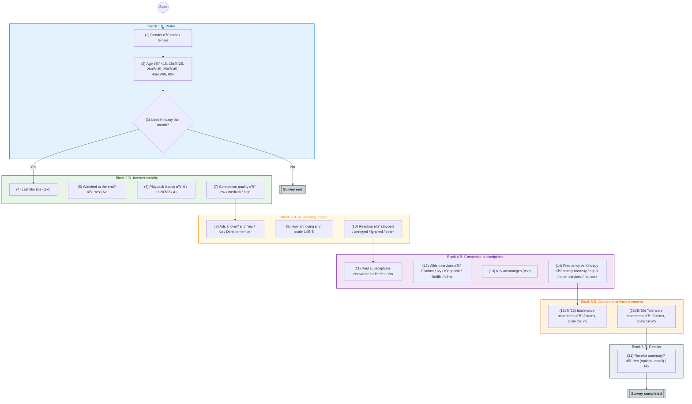

# Kinozuy Survey — flow diagram

```mermaid
flowchart TD
    classDef b1 fill:#E3F2FD,stroke:#1E88E5,color:#0D47A1,stroke-width:2px
    classDef b2 fill:#E8F5E9,stroke:#2E7D32,color:#1B5E20,stroke-width:2px
    classDef b3 fill:#FFF8E1,stroke:#F9A825,color:#F57F17,stroke-width:2px
    classDef b4 fill:#F3E5F5,stroke:#6A1B9A,color:#4A148C,stroke-width:2px
    classDef b5 fill:#FFF3E0,stroke:#EF6C00,color:#E65100,stroke-width:2px
    classDef b6 fill:#ECEFF1,stroke:#455A64,color:#263238,stroke-width:2px
    classDef endNode fill:#CFD8DC,stroke:#37474F,color:#263238,font-weight:bold

    start((Start)) --> B1Q1

    subgraph B1["Block 1 В· Profile"]
        direction TB
        B1Q1["(1) Gender — male / female"]
        B1Q2["(2) Age — <18, 18–25, 26–35, 35–45, 45–60, 60+"]
        B1Q3{"(3) Used Kinozuy last month?"}
    end
    class B1 b1

    B1Q1 --> B1Q2 --> B1Q3
    B1Q3 -->|Yes| B2Q4
    B1Q3 -->|No| EndEarly[[Survey end]]

    subgraph B2["Block 2 В· Internet stability"]
        direction TB
        B2Q4["(4) Last film title (text)"]
        B2Q5["(5) Watched to the end? — Yes / No"]
        B2Q6["(6) Playback issues — 0 / 1 / 2–3 / 4+"]
        B2Q7["(7) Connection quality — low / medium / high"]
    end
    class B2 b2

    subgraph B3["Block 3 В· Advertising impact"]
        direction TB
        B3Q8["(8) Ads shown? — Yes / No / Don't remember"]
        B3Q9["(9) How annoying — scale 1–5"]
        B3Q10["(10) Reaction — stopped / annoyed / ignored / other"]
    end
    class B3 b3

    subgraph B4["Block 4 В· Competitor subscriptions"]
        direction TB
        B4Q11["(11) Paid subscriptions elsewhere? — Yes / No"]
        B4Q12["(12) Which services — Filmbox / Ivy / Kinopoisk / Netflix / other"]
        B4Q13["(13) Key advantages (text)"]
        B4Q14["(14) Frequency vs Kinozuy — mostly Kinozuy / equal / other services / not sure"]
    end
    class B4 b4

    subgraph B5["Block 5 В· Attitude to antisocial content"]
        direction TB
        B5Int["(15–22) Intolerance statements — 8 items, scale 1–5"]
        B5Tol["(23–30) Tolerance statements — 8 items, scale 1–5"]
    end
    class B5 b5

    subgraph B6["Block 6 В· Results"]
        direction TB
        B6Q31["(31) Receive summary? — Yes (optional email) / No"]
    end
    class B6 b6

    B2Q7 --> B3Q8
    B3Q10 --> B4Q11
    B4Q14 --> B5Int
    B5Tol --> B6Q31
    B6Q31 --> EndFinal[[Survey completed]]

    class EndEarly,EndFinal endNode
```
